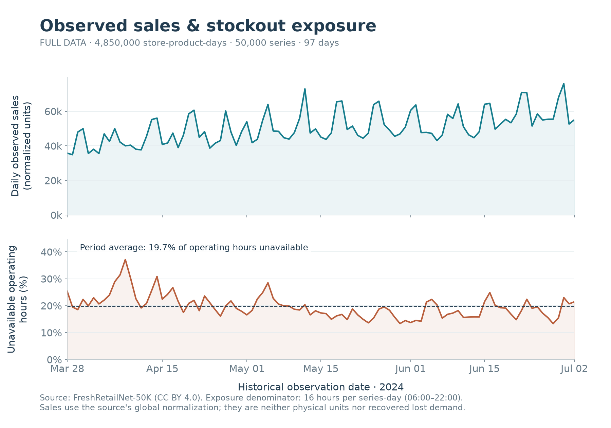
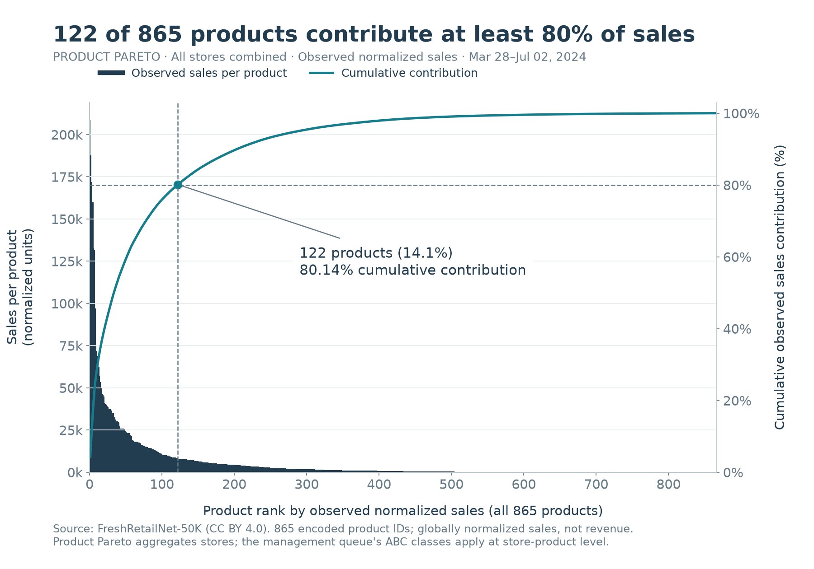
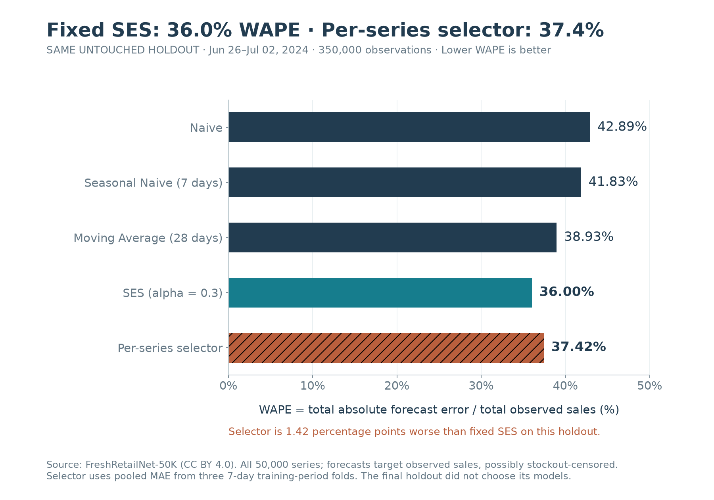
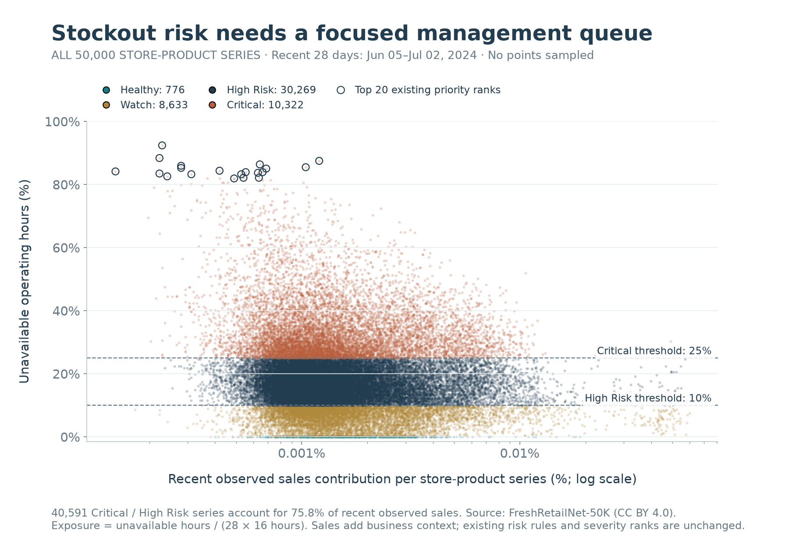
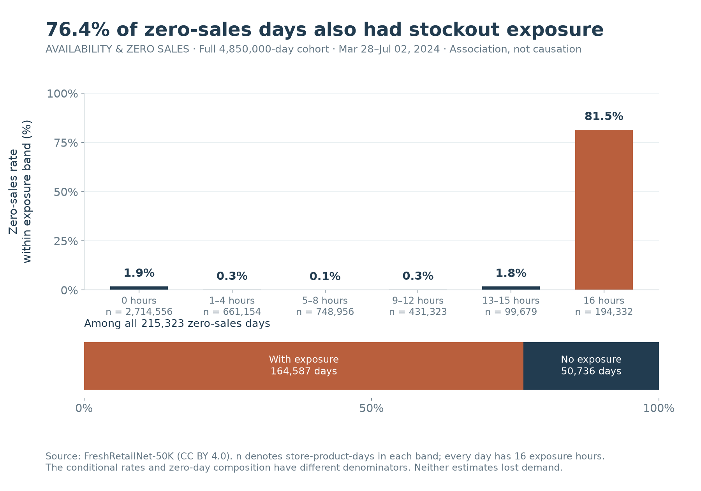
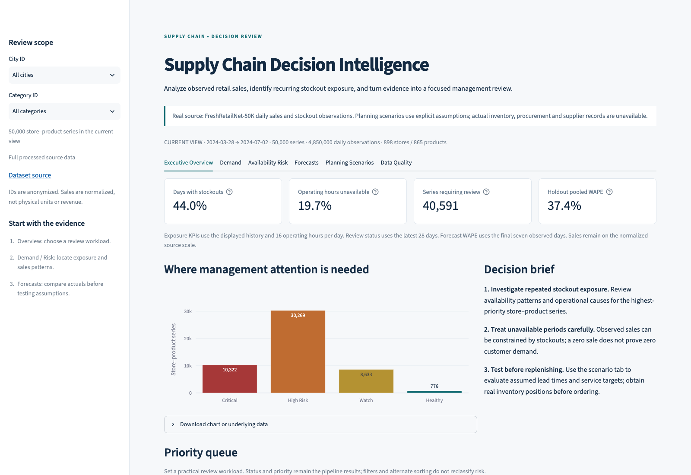
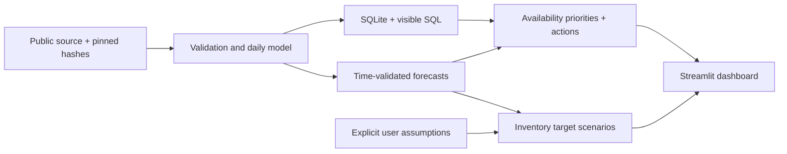

# Supply Chain Decision Intelligence

An end-to-end supply-chain analytics project using real public retail data to prioritize availability risk, evaluate sales forecasts and support transparent replenishment planning.

[](https://github.com/hql7-luo/supply-chain-decision-intelligence/actions/workflows/ci.yml)

**Real data:** [FreshRetailNet-50K · Dingdong-Inc](https://huggingface.co/datasets/Dingdong-Inc/FreshRetailNet-50K) · CC BY 4.0 · **4.85M observations / 50,000 store-product series / 865 products**.

**[Open the real-data interactive Demo](https://hql7-luo.github.io/demos/supply-chain/)** · 200 series / 19,400 real observations · no installation or sign-in. This GitHub Pages explorer shows subset trends, priorities and forecasts; its metrics are separate from the full-data findings below. [Bilingual case study](https://hql7-luo.github.io/projects/supply-chain-decision-intelligence.html)

## The project in 30 seconds

**Question:** which store-product series need availability review, and which observed-sales forecast is a credible planning baseline?

| Evidence from the full dataset | Business recommendation |
| --- | --- |
| **44.0% of daily records had stockouts**; 19.7% of operating hours were unavailable | Investigate repeated exposure before treating low recorded sales as low demand |
| **122 / 865 products (14.1%) contribute ≥80% of observed sales** | Focus review capacity on high-contribution products with recurring availability issues |
| **SES: 36.0% WAPE · per-series selection: 37.4%** | Keep the stronger simple baseline visible; validate prospectively before adopting a model policy |

Scope: **97 historical days, 2024-03-28–2024-07-02**. Sales use a globally normalized scale, not physical units or revenue. This independent public-data project does not claim realized commercial savings.

### 1. Historical Demand & Stockout Trends



The aligned panels separate **recorded sales** from **availability exposure** across all 50,000 series. They show timing, not a causal estimate of lost sales. Review stockout patterns alongside demand before changing replenishment.

### 2. ABC / Pareto Analysis



**122 products reach 80% of full-period observed sales.** Use concentration to focus investigation; this descriptive ABC adaptation measures normalized sales contribution, not revenue, margin or inventory value.

### 3. Forecast Model Comparison



All five methods use the same **June 26–July 2 holdout / 350,000 observations**. The selector was chosen using three earlier rolling validation folds. Fixed SES performs **1.42 percentage points better** on this holdout; the negative result is retained. Forecasts target observed sales, not recovered demand.

[Management brief](docs/executive_summary.md) · [Data quality](docs/data_quality_report.md) · [Methods](docs/methodology.md) · [Dataset comparison](docs/dataset_selection.md)

## Visualization Gallery

### Stockout Risk Matrix



**40,591 series (81.2%) are Critical or High Risk** under unchanged latest-28-day rules. They represent 75.8% of recent observed sales. Both axes use **June 5–July 2**; the matrix relates contribution to exposure. Dashboard Top 20 / Top 50 views make this broad review queue manageable, with selectable sales/exposure sorting. They do not authorize automatic orders.

### Availability & Zero-Sales Analysis



**164,587 / 215,323 zero-sales days (76.4%) also had stockout exposure.** Zero sales alone are not proof of no demand. Group rates use each group's own denominator; coexistence does not establish the cause or amount of lost demand.

All five charts are generated from the full SQLite analysis and reconciled with saved evidence. [Chart data and checks](docs/evidence/visualizations.json) · [Generator](scripts/build_visualizations.py). No hand-entered chart values.

## Dashboard experience



Six existing tabs retain demand, risk, forecasts, scenario planning and source-quality checks. Review **Top 20 / Top 50**, filter status, sort by business contribution or exposure, inspect a series' action and reason, compare actuals with scored predictions, and download chart HTML / CSV data / PNG. City and category filters retain the original analytical definitions.

## Analytics and dashboard

| Area | What it demonstrates |
| --- | --- |
| Python + data modeling | Full raw audit, immutable originals, store-product-date grain and constrained SQLite star schema |
| Visible SQL | Category availability, monthly sales, product Pareto concentration, recent risk queue and store benchmarks in [sql/](sql/) |
| Demand forecasting | Naive, weekly seasonal naive, 28-day mean and exponential smoothing; three expanding validation folds inside 90 train days, then untouched 7-day holdout |
| Inventory decision support | Real stockout-hour/day metrics; descriptive sales-contribution ABC and observed-sales XYZ; deterministic action/reason table |
| Planning scenarios | Demand shocks, lead-time disruptions, service targets, safety-stock/reorder-point sensitivity and gap to a user-assumed inventory position |
| Streamlit + Plotly | Six tabs, scoped KPIs, aligned sales/stockout trends, Top 20/50 priorities, scored forecast detail and chart/data downloads |
| Testing + reproducibility | Analytical edge cases, leakage safeguards, source validation, SQL reconciliation, app interaction checks and real-demo recomputation |

No supplier table, current stock balance, procurement history, realized savings or LLM is fabricated.

## Try the dashboard

The verified [online Demo](https://hql7-luo.github.io/demos/supply-chain/) is a public static Plotly explorer on GitHub Pages. The complete **six-tab Streamlit app**, including planning scenarios, runs locally with the same real demo database. See [deployment scope and platform assessment](docs/online_demo.md).

CI is configured for Python **3.11 and 3.12**. Install [uv](https://docs.astral.sh/uv/getting-started/installation/), then:

```bash
git clone https://github.com/hql7-luo/supply-chain-decision-intelligence.git
cd supply-chain-decision-intelligence
uv sync --frozen --python 3.11 --extra dev --extra viz
uv run streamlit run app/dashboard.py
```

The committed **200-series / 19,400-row real-data demo** starts immediately. It is a deterministic stratified illustration across availability statuses, not a representative population sample. The app labels demo scope and computes its KPIs only on those records.

## Reproduce the full analysis

```bash
uv run python scripts/download_data.py
uv run python scripts/run_pipeline.py
uv run python scripts/build_reports.py
uv run --extra viz python scripts/build_visualizations.py
uv run pytest -q
uv run python scripts/verify_demo.py
uv run streamlit run app/dashboard.py
```

The downloader needs no credentials. It fetches the original 106.4 MB train + 8.4 MB eval files from a pinned public revision and verifies SHA-256. For manual download, use the exact URLs in [download_manifest.json](docs/evidence/download_manifest.json), place both files in `data/raw/`, and run the same processing command. Keep roughly 1 GB of free disk space and allow several minutes for the full audit and database build.

The full database takes precedence over the demo. To force a reviewed demo run:

```bash
SCDI_DATABASE=data/demo/decision_intelligence.sqlite uv run streamlit run app/dashboard.py
```

To rebuild the credential-free static explorer from the same real 200-series cohort: `uv run python scripts/build_web_demo.py --output /path/to/static/site/demos/supply-chain`. It provides trends, priorities and actual-versus-forecast inspection; the six-tab Streamlit app also includes interactive planning scenarios.

Lint and syntax checks: `uv run ruff check .`, `uv run ruff format --check .`, and `uv run python -m compileall -q src scripts app`. CI also recomputes saved demo forecasts, priorities and all SQL queries, without a network data download. Chart rebuilding additionally requires the `viz` extra and the full processed database.

## Architecture



```text
app/                  Streamlit decision dashboard
src/scdi/             Validation, SQLite, forecasts, inventory rules, scenarios
sql/                  Five inspectable business queries
scripts/              Download, full pipeline, reports and demo verification
tests/                Meaningful analytical, data, SQL and application checks
notebooks/            Inspectable audit and SQL exploration
docs/                 Management findings, methodology, evidence and screenshot
data/raw/             Original Parquet files, excluded from Git
data/processed/       Full SQLite and analytical CSV outputs, excluded from Git
data/demo/            Small attributed real-data adaptation, committed
```

[Architecture details](docs/architecture.md) · [Audit notebook](notebooks/01_data_audit.ipynb)

## Provenance and limitations

**Dataset:** FreshRetailNet-50K, developed by Dingdong-Inc. Original [dataset card](https://huggingface.co/datasets/Dingdong-Inc/FreshRetailNet-50K) and [research paper](https://arxiv.org/abs/2505.16319). License: [CC BY 4.0](data/LICENSE.md). Downloaded **2026-10-06 UTC**; pinned revision `08c1fab7f9257bc73679d415d65d644165d351d4`. Full raw files are not stored on GitHub for size; the attributed real demo and derived evidence are stored.

**Real fields:** dates, globally normalized daily/hourly sales, encoded product/category/store/city IDs, hourly stockout flags, discount, holidays, activities and weather. **Synthetic source fields: none.** Renaming, aggregation, forecasts and classifications are analytical transformations. Lead-time distribution, service target and inventory position are separate, visible scenario assumptions.

The data covers **2024-03-28–2024-07-02**, not current inventory. It contains no on-hand quantity, unit price/cost, supplier, purchase order, shelf life or spoilage cost. Consequently there are no actual inventory values, turnover, EOQ, supplier rankings, realized service levels or executable replenishment orders. All monetary or physical-unit conclusions would need additional data. The normal-approximation planning formula assumes independent stationary demand and lead time; it is particularly limited for perishable/intermittent and stockout-censored demand. Annual seasonality and lost demand are not estimated.

Code is MIT licensed; source and derived data retain their separate CC BY 4.0 attribution. See [data rights](data/LICENSE.md).
