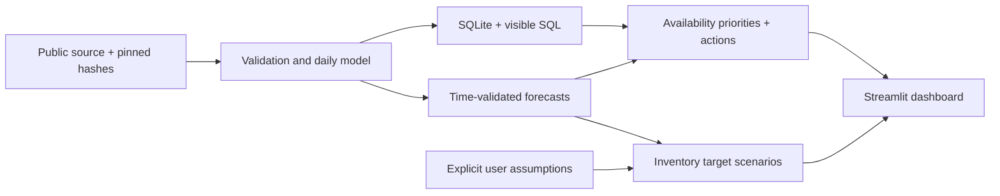

# Supply Chain Decision Intelligence

An end-to-end supply-chain analytics project using real public retail data to prioritize availability risk, evaluate sales forecasts and support transparent replenishment planning.

[](https://github.com/hql7-luo/supply-chain-decision-intelligence/actions/workflows/ci.yml)

**Real data:** [FreshRetailNet-50K · Dingdong-Inc](https://huggingface.co/datasets/Dingdong-Inc/FreshRetailNet-50K) · CC BY 4.0 · **4.85M observations / 50,000 store-product series / 865 products**.


## Business value

Which store-product combinations need attention? Where do recurring stockouts make recorded sales an incomplete measure of demand? What inventory target follows from explicit lead-time and service assumptions?

This project connects **Supply Chain + Business Analytics + Information Systems + Decision Support**. It produces a reproducible management queue, forecasts with transparent benchmarks, and an interactive planning tool. It is an independent public-data portfolio project; the data is not from an employer, internship or customer.

## What the real data shows

- **44.0% of store-product-days had stockouts**; unavailable hours represent 19.7% of operating hours.
- **122 products (14.1%) generate at least 80% of normalized sales.** This is sales concentration, not revenue.
- **76.4% of zero-sales days also had stockout exposure.** Observed sales do not reveal all latent demand.
- **40,591 series require review under the latest 28-day heuristic.** This broad queue is for investigation, not automatic purchase orders.
- **Forecast honesty:** the rolling-validation per-series selector scores 37.4% holdout WAPE; the simpler fixed SES baseline scores 36.0%. Model flexibility did not improve the strongest aggregate baseline. All four baselines and this negative result are reported.

[Management brief](docs/executive_summary.md) · [Data quality](docs/data_quality_report.md) · [Methods](docs/methodology.md) · [Dataset comparison](docs/dataset_selection.md)

## Analytics and dashboard

| Area | What it demonstrates |
| --- | --- |
| Python + data modeling | Full raw audit, immutable originals, store-product-date grain and constrained SQLite star schema |
| Visible SQL | Category availability, monthly sales, product Pareto concentration, recent risk queue and store benchmarks in [sql/](sql/) |
| Demand forecasting | Naive, weekly seasonal naive, 28-day mean and exponential smoothing; three expanding validation folds inside 90 train days, then untouched 7-day holdout |
| Inventory decision support | Real stockout-hour/day metrics; descriptive sales-contribution ABC and observed-sales XYZ; deterministic action/reason table |
| Planning scenarios | Demand shocks, lead-time disruptions, service targets, safety-stock/reorder-point sensitivity and gap to a user-assumed inventory position |
| Streamlit + Plotly | Six tabs, city/category filters, sortable tables, forecast charts, downloadable recommendations and visible scope/assumption notes |
| Testing + reproducibility | Analytical edge cases, leakage safeguards, source validation, SQL reconciliation, app interaction checks and real-demo recomputation |

No supplier table, current stock balance, procurement history, realized savings or LLM is fabricated.

## Try the dashboard

CI is configured for Python **3.11 and 3.12**. Install [uv](https://docs.astral.sh/uv/getting-started/installation/), then:

```bash
git clone https://github.com/hql7-luo/supply-chain-decision-intelligence.git
cd supply-chain-decision-intelligence
uv sync --frozen --python 3.11 --extra dev
uv run streamlit run app/dashboard.py
```

The committed **200-series / 19,400-row real-data demo** starts immediately. It is a deterministic stratified illustration across availability statuses, not a representative population sample. The app labels demo scope and computes its KPIs only on those records.

## Reproduce the full analysis

```bash
uv run python scripts/download_data.py
uv run python scripts/run_pipeline.py
uv run python scripts/build_reports.py
uv run pytest -q
uv run python scripts/verify_demo.py
uv run streamlit run app/dashboard.py
```

The downloader needs no credentials. It fetches the original 106.4 MB train + 8.4 MB eval files from a pinned public revision and verifies SHA-256. For manual download, use the exact URLs in [download_manifest.json](docs/evidence/download_manifest.json), place both files in `data/raw/`, and run the same processing command. Keep roughly 1 GB of free disk space and allow several minutes for the full audit and database build.

The full database takes precedence over the demo. To force a reviewed demo run:

```bash
SCDI_DATABASE=data/demo/decision_intelligence.sqlite uv run streamlit run app/dashboard.py
```

Lint and syntax checks: `uv run ruff check .`, `uv run ruff format --check .`, and `uv run python -m compileall -q src scripts app`. CI also recomputes saved demo forecasts, priorities and all SQL queries, without a network data download.

## Architecture



```text
app/                  Streamlit decision dashboard
src/scdi/             Validation, SQLite, forecasts, inventory rules, scenarios
sql/                  Five inspectable business queries
scripts/              Download, full pipeline, reports and demo verification
tests/                Meaningful analytical, data, SQL and application checks
notebooks/            Inspectable audit and SQL exploration
docs/                 Management findings, methodology, evidence and screenshot
data/raw/             Original Parquet files, excluded from Git
data/processed/       Full SQLite and analytical CSV outputs, excluded from Git
data/demo/            Small attributed real-data adaptation, committed
```

[Architecture details](docs/architecture.md) · [Audit notebook](notebooks/01_data_audit.ipynb)

## Provenance and limitations

**Dataset:** FreshRetailNet-50K, developed by Dingdong-Inc. Original [dataset card](https://huggingface.co/datasets/Dingdong-Inc/FreshRetailNet-50K) and [research paper](https://arxiv.org/abs/2505.16319). License: [CC BY 4.0](data/LICENSE.md). Downloaded **2026-10-06 UTC**; pinned revision `08c1fab7f9257bc73679d415d65d644165d351d4`. Full raw files are not stored on GitHub for size; the attributed real demo and derived evidence are stored.

**Real fields:** dates, globally normalized daily/hourly sales, encoded product/category/store/city IDs, hourly stockout flags, discount, holidays, activities and weather. **Synthetic source fields: none.** Renaming, aggregation, forecasts and classifications are analytical transformations. Lead-time distribution, service target and inventory position are separate, visible scenario assumptions.

The data covers **2024-03-28–2024-07-02**, not current inventory. It contains no on-hand quantity, unit price/cost, supplier, purchase order, shelf life or spoilage cost. Consequently there are no actual inventory values, turnover, EOQ, supplier rankings, realized service levels or executable replenishment orders. All monetary or physical-unit conclusions would need additional data. The normal-approximation planning formula assumes independent stationary demand and lead time; it is particularly limited for perishable/intermittent and stockout-censored demand. Annual seasonality and lost demand are not estimated.

Code is MIT licensed; source and derived data retain their separate CC BY 4.0 attribution. See [data rights](data/LICENSE.md).
