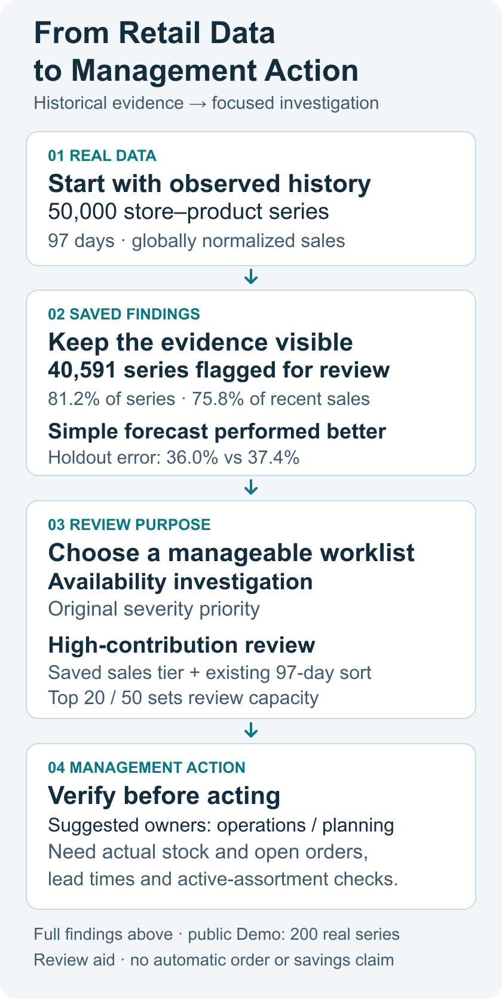

# 供应链决策分析

[English](README.md) · [中文](README.zh-CN.md)

商品缺货可能使零售商错过销售机会，但已记录的销量不能直接说明哪些商品需要优先关注。我主导了这项基于真实零售历史的 AI 辅助分析，聚焦缺货调查和销售预测比较。

**我的职责：** 提出业务和可视化需求、审阅最终输出；AI 辅助完成分析与工程实现。

**[打开真实数据 Demo](https://hql7-luo.github.io/demos/supply-chain/)** · 200 条真实门店—商品序列 / 19,400 条日记录 · 无需登录。[双语案例页](https://hql7-luo.github.io/projects/supply-chain-decision-intelligence.html)

图中数字来自**全量历史分析**；线上 Demo 是独立的 200 条序列演示，指标不能混用。[图示来源与范围](docs/evidence/management-action-overview.json)

## 哪些发现影响管理判断

- **缺货调查范围很广：** 最近 28 天有 **40,591 条序列（81.2%）** 被标为 Critical / High Risk，占最近观测销量的 75.8%。应先限制调查工作量，再核对原因；标签不能直接变成补货指令。
- **观测销量集中：** **122 / 865 个商品**贡献至少 80% 的完整历史观测销量。可以结合反复缺货，关注高贡献条目；这不是收入、毛利或库存价值排序。
- **简单预测在留出期更好：** 固定指数平滑 SES 的 WAPE 为 **36.0%**，逐序列选择模型为 **37.4%**。WAPE 是绝对预测误差总量占实际观测销量总量的比例，越低越好。应保留这个负面比较结果，使用新时期数据再评估，而不是按该留出期修改模型选择。
- **零销量不等于零需求：** 76.4% 的零销量日也有缺货记录。销量可能受可用性限制，共现不能证明丢失需求的原因或数量。

**数据范围：** Dingdong-Inc / FreshRetailNet-50K，CC BY 4.0；**485 万条记录 / 50,000 条门店—商品序列 / 865 个商品 / 97 天**，2024 年 3 月 28 日至 7 月 2 日。缺货窗口是 6 月 5 日至 7 月 2 日；预测比较使用相同的 6 月 26 日至 7 月 2 日留出期。销量经过全球归一化，不能直接换算成实际件数或金额。[保存的全量证据](docs/evidence/findings.json)

## 两种互补的管理调查

1. **可用性调查：** 筛选 Critical / High Risk，使用原始严重程度排序，先查看缺货暴露最严重的条目。建议由门店运营负责人核对是否仍在售、记录是否可靠及运营原因，再与补货计划人员讨论。
2. **高贡献条目复核：** 在同样缺货状态中，利用已有销量排序及已保存的 A 类标记。A-only 工作列表按已有门店—商品 A 类筛选，再按 97 天观测销量排序；保留原始风险标签和优先级。建议补货计划人员与门店运营共同复核。

**行动前需要什么：** 实际库存、在途和未结订单、真实交期、在售状态与保质期；若要判断财务收益，还需要单位价格、成本和可换算的原始规模。这些信息不在公开数据中。A 类基于保存分析群体的历史销量，城市或品类筛选不会重新分级；它与“122 个商品”的跨门店商品集中度是不同粒度。

**怎样体验已有切换：** 在线 Demo 保持 **Critical + High Risk**，选 **Top 20 / Top 50**，比较 **Pipeline priority** 与 **Recent observed sales**，点击 Review 查看原因、历史和预测。Top 20/50 是调查容量。在线销量排序用最近 28 天；本地 Streamlit 的 **Highest observed sales** 用完整 97 天，并显示 ABC 列。当前没有专用 A-only 在线按钮，这里是基于已有字段的调查定义，不是新增分数或优化算法。[英文管理行动 brief](docs/management_brief.md)

## 我的贡献与项目展示的能力

这是个人 AI 辅助项目。我主导库存风险、需求预测和供应决策方向，提出功能、业务分析及可视化要求，审阅最终输出。AI 辅助完成数据处理、预测分析、Dashboard 和工程测试。

项目展示业务问题定义、分析证据审阅、预测与库存风险概念、管理沟通；技术实现包含 Python、SQL、时间验证和 Streamlit。个人贡献对应项目方向、需求和输出审阅，技术实现由 AI 辅助。

## 深层证据与界限

五张原始分析图、完整模型比较、SQL 和原始缺货排序示例继续保留在[英文 README](README.md#detailed-analytical-evidence)及[生成的技术报告](docs/generated_analysis.md)。[方法](docs/methodology.md) · [数据质量](docs/data_quality_report.md) · [来源和许可](data/LICENSE.md) · [Demo 范围](docs/online_demo.md)

线上 Demo 是按可用性组确定性选择的真实子集，不代表总体；其 KPI 和 ABC 分类仅属于这 200 条序列。没有产生新的全量 Top 20/50 名单。项目不包含当前库存、采购订单、供应商交期、价格成本、保质期或损耗成本；场景使用显式假设。管理视图用于调查和敏感性讨论，不代表正式库存优化、自动下单、已实现节省或真实企业部署。
