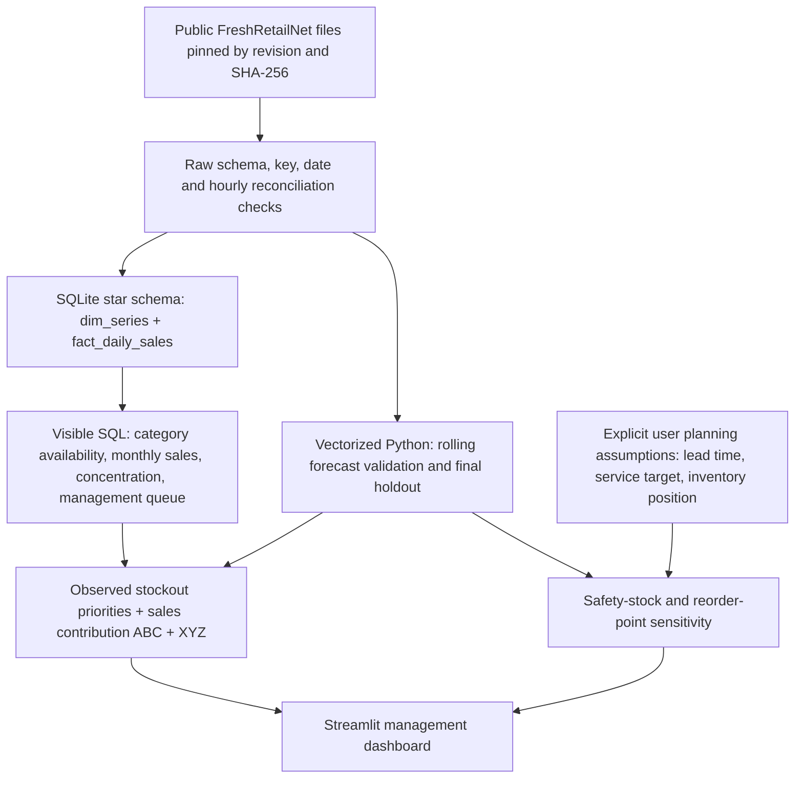

# Architecture and analytical grain

The analytical grain is one **store-product-date**, not one SKU across all stores.
`series_id = store_id:product_id`. The fact table has a composite primary key
`(series_id, date)` and a foreign key to `dim_series`. Encoded category/store
attributes are stored once per series. `daily_sales` is a convenience join view.

Raw data and the full SQLite database are local generated files. A small, real-data
demo is committed so a recruiter can launch the app without a 115 MB download.
The demo is selected deterministically across priority groups and cannot represent
population prevalence. Full-data findings have their own scope in the evidence files.

Forecast results, quality evidence and management outputs are saved by the pipeline;
the dashboard reads SQLite and recomputes only user-driven planning scenarios.
Operational assumptions never overwrite source data and are never turned into
invented supplier, inventory or procurement tables.
